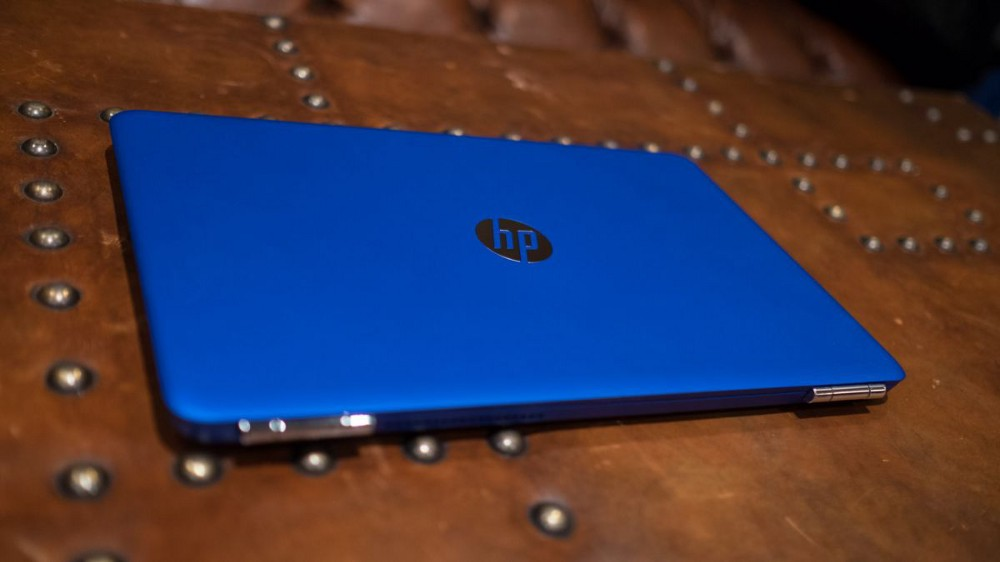

  <small>Starter pack...</small>

Ever wondered how a typical day of young aspiring developer would look like?
Especially if you don’t have a roadmap on how to become a software developer.
software development can be really frustrating, even for the “experts”.

All I can say, programming is terrible, so learn to enjoy it. If you are “on the net” learning about what programming is like, listening to the voices that get the most attention, you are probably getting the “Hollywood version” of what it means to work with software day in and day out.
Now don’t get me wrong, I love programming... Here is a great article by Ukiah Smith that I recommend: [Programming is Terrible, So Learn to Enjoy It](https://ukiahsmith.com/blog/programming-is-terrible-so-learn-to-enjoy-it/).

As a newbie in the software development world, I gain more by reading new articles on the internet mostly on the blogs and different programming documentation.
Also not forgetting tutorials (I hope one day I’ll be a developer and give back to the world by writing tutorials), and roadmaps provided by this guy called Brandon Morelli e.g [The Ultimate Guide to Learning Full Stack Web Development in 6 months, for $30](https://codeburst.io/the-ultimate-guide-to-learning-full-stack-web-development-in-6-months-for-30-72b3854a7458).
So here is my typical day as an aspiring Full Stack Web Developer :

- **5:00 am — 8:15 am**: I don’t usually wake up at 5 am but when I do, First thing is to turn on the lights (I know most of you thought it is turning on my computer 😝) and the next thing obviously is to turn my computer on. Look at my E-mails and slack chat (I guess this should be done within every hour) to keep you update and most importantly never ignore programming newsletter that you have subscribed to. If I had a pending problem from yesterday, It is the first thing I look and try to solve and ask for help on any online forums. Then later jump into Freecodecamp (I wish I had money, I would contribute the $5/month donation every day), I have learned a lot from this website plus the free certification 😍. Finally, it’s 8:00 am before I break for breakfast I twitter about my progress of the last 24 hours ( I’m participating in this challenge called 100 days of code) and update my GitHub repository on the same.

- **10:00 am — 4:00 pm:** after having my breakfast (please comment below if you are interested in what I took for breakfast 😉), I start by planning on what I’m going to tackle the whole day and a topic. Then I jump from one website to another, blog to blog until I’m satisfied that I have got enough knowledge to start coding on the same topic e.g if it’s was on Python functions I start coding on it. Find a simple project on the same and write it to test myself if I have understood. Mostly I go through articles that have the topic that I need or in relation to it. I sometimes take a break by playing an online game or chat with people. The most important point I have taken is never prioritize self-learning sometimes look for developers platform or forums ask for questions, Google does not have all answers and also it’s healthy to diversify your thinking and see what other people do. So I usually try to post questions, talk to other developers and help those who are stuck or don’t where to begin in programming. Since I began learning software developing, this community of developers has been inspiring like everyone is always there waiting for you to join and give a hand so that you can gain more and go fast on your learning. By 4:00 pm I’m pretty hungry, tired and ready for a break from all the coding and learning process I have been going through the whole day.

- **4:00 pm — 8:00 pm:** This a break for me, I usually take a shower and then go out to a restaurant and have lunch. Take a walk around the city, make new friends in the streets( I know this weird to those who know me 😂)and at least interact with new people have a new perspective on life. It’s advisable to meet new people so as to have a great growth mindset. Later, after I get exhausted I take supper and then head back home.

- **8:30 pm — 12:00 pm:** This time I mostly use it to code my projects and improve them. I set a goal at least every month I’m able to complete a project. On the same, I improve my projects with different technologies learned. I also take 20 minutes before I sleep to reflect on my work.

### The day in review

Reflecting on a typical working day, I’d say I spend 40% of my time on project work, 20% on blogs and general communication i.e forums, calling, texting and on slack, and the remaining 25% learning new ways on how to program and new technologies on the programming languages.

My daily toolkit consists mainly of IDE or editor(visual studio code, sublime text, ruby mine), a project management tool, Slack, WhatsApp, and Gmail for communication, GitHub for code version control, sticky-notes for note-taking, and Google Drive for anything miscellaneous.'

The biggest challenge to my productivity on a daily basis is definitely the ad-hoc requests I get from people and laziness sometimes (some days I wake up and don’t feel like getting out of bed).
WhatsApp can be really distracting, but it’s also a communications tool we just couldn’t do without. It’s important to manage other people’s expectations and to balance on your learning, and knowing when to shut yourself off and focus on your learning progress.

### Wrapping Up

Finally, I wouldn’t be nearly as effective at this journey of becoming a software developer if it all wasn’t about passion.
Being passionate about what I do keeps me motivated from day to day: I wake up each morning knowing that what I’m working on has a direct and visible impact. I can see things improving as a result of my effort, and that’s really satisfying.

For any question hit my dm on [twitter](https://twitter.com/b0nvic)

Thanks for reading, cheers 🥂
