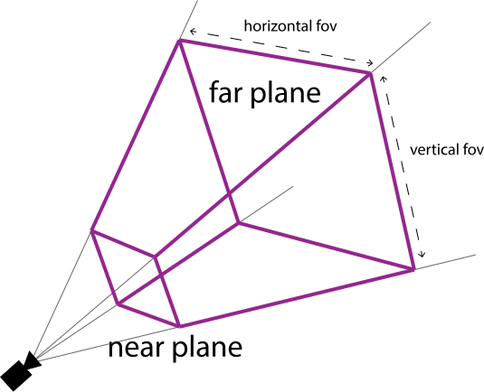
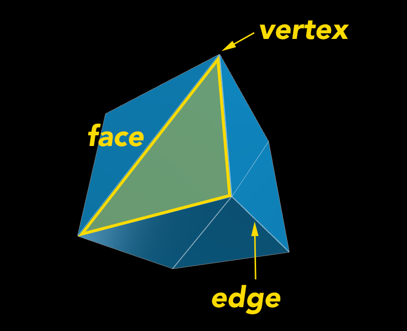

# Introduction to Threejs
This is the first article in a series of articles about three.js. Three.js is a 3D library that tries to make it as easy as possible to get 3D content on a webpage.

## First up, what is WebGL?
WebGL is a web technology that brings hardware-accelerated 3D graphics to the browser, without the need for installing additional plugins or downloading extra software.

## And what’s Three.js?
Both OpenGL and WebGL are relatively complex.

Three.js is here to help. It’s an open-source library that simplifies the creation of WebGL tools and environments. It covers the majority of the lower level programming involved in developing GPU-accelerated 3D animations.

We are going to learn how to build a simple scene using Three.js

## Enough chat. Let’s code.
let's start by setting up the html file where we will render our 3D scene. we create html file and add the following codes:

```html
<!DOCTYPE html>
<html>
	<head>
		<meta charset="utf-8">
		<title>My first three.js app</title>
		<style>
			body { margin: 0; }
			canvas { display: block; }
		</style>
	</head>
	<body>
  <script src="https://threejs.org/build/three.js"></script>
		<scrip src="js/app.js"></script> // create folder js and add file app.js
	</body>
</html>
```
all of our three.js codes will go to `js/app.js`.

## The Scene
A scene is the 3D space or stage containing all the objects we want to render. It allows you to set what is going to be rendered. This where you palce the objects, lights and cameras.

```js
var scene = new Three.Scene();
```

### The Camera
a (perspective) Camera simulates the behaviour of a film camera in real life. There are other camera like ArrayCamera, CubeCamera, OrthographicCamera, StereoCamera but we are going to focus on PerspectiveCamera.
The position and direction of your Camera will determine how the scenes will get rendered to the screen. While setting up your camera you need to pass in field of view, an aspect ratio, a near plane, and a far plane. These 4 values dictate the 3D space (viewing frustum) that can be captured by your camera.

***fov:*** The vertical field of view. This dictates the size of the vertical space your camera's view can reach.

***aspect:*** This is the aspect ratio you use to create the horizontal field of view based off the vertical.

***near:*** This is the nearest plane of view (where the camera's view begins).

***far:*** This is the far plane of view (where the camera's view ends).



Where your objects are within the viewing fustrum will effect how they appear rendered in your screen. Speaking of rendering, you'll need to add a Three.js renderer - a view that contains your camera's "picture".

```js
// add a camera
// THREE.PerspectiveCamera(fov, aspect, near, far)
var camera = new THREE.PerspectiveCamera(
  75, // fov
  window.innerWidth/window.innerHeight, // aspect ratio 
  0.1, // near clipping plane
  1000 // far clipping plane
);

// place the camera at z of 100
camera.position.z = 100;

// add a renderer
var renderer = new THREE.WebGLRenderer();
renderer.setSize( window.innerWidth, window.innerHeight );
// add the renderer element to the DOM so it is in our page
document.body.appendChild( renderer.domElement );
```

### Lighting
Just like a room the scene also needs the light so that the objects can be visible. In THREE.js there are different kinds of lighting, and they're listed below with their description:

***AmbientLight:*** This light globally illuminates all objects in the scene equally. less of a light source and more of a soft color tint for the scene.

```js
var light = new THREE.AmbientLight( 0x404040 ); // soft white light
scene.add( light );
```

***DirectionalLight:*** A light that gets emitted in a specific direction. This light will behave as though it is infinitely far away and the rays produced from it are all parallel. The common use case for this is to simulate daylight; the sun is far enough away that its position can be considered to be infinite, and all light rays coming from it are parallel.

```js
// White directional light at half intensity shining from the top.
var directionalLight = new THREE.DirectionalLight( 0xffffff, 0.5 );
scene.add( directionalLight );
```

***HemisphereLight:*** A light source positioned directly above the scene, with color fading from the sky color to the ground color (think of ocean scene).

```js
var light = new THREE.HemisphereLight( 0xffffbb, 0x080820, 1 );
scene.add( light );
```

***PointLight:*** A light that gets emitted from a single point in all directions. A common use case for this is to replicate the light emitted from a bare lightbulb.

```js
var light = new THREE.PointLight( 0xff0000, 1, 100 );
light.position.set( 50, 50, 50 );
scene.add( light );
```

***RectAreaLight:*** RectAreaLight emits light uniformly across the face a rectangular plane. This light type can be used to simulate light sources such as bright windows or strip lighting.

```js
var width = 10;
var height = 10;
var intensity = 1;
var rectLight = new THREE.RectAreaLight( 0xffffff, intensity,  width, height );
rectLight.position.set( 5, 5, 0 );
rectLight.lookAt( 0, 0, 0 );
scene.add( rectLight )

rectLightHelper = new THREE.RectAreaLightHelper( rectLight );
rectLight.add( rectLightHelper );
```

***SpotLight:*** just as name suggests, This light gets emitted from a single point in one direction, along a cone that increases in size the further from the light it gets.

```js
// white spotlight shining from the side, casting a shadow

var spotLight = new THREE.SpotLight( 0xffffff );
spotLight.position.set( 100, 1000, 100 );

spotLight.castShadow = true;

spotLight.shadow.mapSize.width = 1024;
spotLight.shadow.mapSize.height = 1024;

spotLight.shadow.camera.near = 500;
spotLight.shadow.camera.far = 4000;
spotLight.shadow.camera.fov = 30;

scene.add( spotLight );
```

so after going through the lighting, we are going to use pointlight for our example:

```js
/* we need to add a light so we can see our cube - its almost
as if we're turning on a lightbulb within the room */
var light = new THREE.PointLight(0xFFFF00);
/* position the light so it shines on the cube (x, y, z) */
light.position.set(10, 0, 25);
scene.add(light);
```

## Geometry

In order to get a long with 3D geometry on WEBGL we need to understand a little 3D modelling terminology.

3D models (or meshes) are made up of vertices, edges and faces.

***Vertices:*** the points of intersection between 3 edges.

***Edges:*** an edge where two faces meet (think of the edges of a cube).

***Faces:*** polygons (triangles) that make up the faces of the model.



All 3D models (also named meshes) can be broken down in to these little triangle polygons. You could construct the model geometry yourself by specifying all of the vertice positions, but the great thing about Three.js is that it provides a bunch of methods for you to create primitive shapes.

> *note: I'll be using normal mesh material on the geometry examples but will talk about materials later*

Let's see how you can add some geometry to a 3D scene

```js
// create some geometry - this is how you create some square 
// geometry using the BoxGeometry method
var geometry = new THREE.BoxGeometry( 20, 20, 20);
// create a material
var material = new THREE.MeshNormalMaterial();
// add the geometry to the mesh - and apply the material to it
var cube = new THREE.Mesh( geometry, material );
scene.add( cube );
```
https://codepen.io/b0nbon1/pen/qBbLWmY

If you have tested the code and run, by using scene.add(cube) it has added the mesh we made at the point (0,0,0) in our scene. Just like our camera and lighting, we can update the position of the cube. We can also update the rotation of the cube, which we probably want to do here, since we can't even tell it is a cube when it's facing the camera like above!

To view our cube and know where the camera is we can rotate it and position it so that the cube can be seen:
```js
// rotate cube
cube.rotation.x = 0.45;
cube.rotation.y = -0.25;

// shift cube on the x axis
cube.position.x = -30;
```

results:

https://codepen.io/b0nbon1/pen/bGEObyw


### Materials

The [Three.js documentation](http://threejs.org/docs/) explains this in the most concise way: Materials describe the appearance of objects. Just like objects in real life, the material they are made out of determines how they appear in the 3D world. In the last post, we looked at how to create models/meshes with geometry. By applying a material to the mesh we can specify its color, texture, and how it reflects light.

Let's take a look at a few materials that we can use to create our 3D objects, you can explore materials on three.js.

#### MESHNORMALMATERIAL

The mesh normal material is not the most useful material because you have very little control over how the material appears. This is because the color of the planes of the mesh is dictated by their position. It does make some really pretty rainbow colored objects though so I really like it :) It's worth noting this material isn't effected by lighting.

```js
var material = new THREE.MeshNormalMaterial();
```

#### MESHLAMBERTMATERIAL

The mesh lambert material is described as a non-shiny material, so I like to think of it is a matte-finish material. Like a matte plastic.

You can specify a color for your material or a texture (image).

***An aside: working with Colors within Three.js***
Materials accept a color parameter as a hexadecimal value, eg. 0xffffff. Lucky for us, Three.js has a very handy color object for working with colors. You can create a color by taking a hex string, rgba string or hsl string, and passing it in to the color.

```js
// use hex string
var color = new THREE.Color("#6f4171");
// use rgba string
var color = new THREE.Color("rgba(188, 141, 190, 1)");
```

Then, to get the hexadecimal value of that color you can use one of the Color methods.

```js
var hex = color.getHex()
```

The Color object has a whole bunch of methods to help us do cool things with color. We'll probably look at some of these over the course of these posts but if you can't wait, check out the documentation.

example, creating a MeshLambertMaterial with a flat color:

```js
var color = new THREE.Color( "#7833aa" );
var material = new THREE.MeshLambertMaterial( {color: color.getHex()} );
```
**Using wireframes** Within these materials there is an option to use a wireframe instead of filling all the planes - which is a pretty cool effect in itself. To do this, you just set the wireframe option to true.

```js
var material = new THREE.MeshLambertMaterial( {color: color.getHex(), wireframe: true} );
```

**Creating a MeshLambertMaterial with a texture (image)**

Purple colored materials are super pretty but maybe you want to get fancy and create an image to wrap your mesh in. Maybe you want to create a brick wall with a brick texture. Or maybe you want to create a 3d balloon of your boss's face, which is totally not weird and will probably just impress them with your new 3D talents.

```js
// create a loader to get an image from a URL
var textureLoader = new THREE.TextureLoader();
// we've gotta set this to use cross-origin images
textureLoader.crossOrigin = true;
// load in the image
textureLoader.load('https://source.unsplash.com/random', function(texture) {
  // this code makes the texture repeat
  texture.wrapS = texture.wrapT = THREE.RepeatWrapping;
  texture.repeat.set( 2, 2 );
  // set the texture as the map for the material
  var material = new THREE.MeshLambertMaterial( {map: texture} );
}
```


here is an example with a few animations on it:


https://codepen.io/b0nbon1/pen/ZEQVEOR


#### MESHPHONGMATERIAL

Now we can move on to the MeshPhongMaterial, or as I like to think of it, the fancy person's material. This material is pretty similar to the MeshLamberMaterial except its shiny, (ahhhhhh). Because they are similar you already know how to create a MeshPhongMaterial with a flat color or image texture because you do it the same way you did it with the lambert! Amazing! You're basically a level 12 3D mage now.

```js
var color = new THREE.Color( "#7833aa" );
var material = new THREE.MeshPhongMaterial( {color: color.getHex()} );
```

https://codepen.io/b0nbon1/pen/LYGMYxw

See those flecks of light reflecting off of the mesh? That's because of the shinyness of this material. A couple of properties worth noting is the shinyness property (default of 30) which controls the level of shine, and the specular property which controls the color of that shine.

Okay so you can do some pretty cool things with the MeshPhongMaterial but in my opinion the most fun part is being able to use a bump map. A bump map is a black and white map that creates perceived depth in your object when it is in lighting. This way you can create ridges and bumps in your mesh without having to complicate the geometry.

```js
var textureLoader = new THREE.TextureLoader();
textureLoader.crossOrigin = true;
textureLoader.load('https://s3-us-west-2.amazonaws.com/s.cdpn.io/53148/4268-bump.jpg', function(texture) {
    // apply the texture as a bump map
  var material = new THREE.MeshPhongMaterial( {color: color.getHex(), bumpMap: texture} );
});
```

https://codepen.io/b0nbon1/pen/VwrvLRb

Whaatt! After adding the bump map (a black and white image) to my material, it totally transforms the object to make it look like it has actual ridges. How cool is that!?! I will only accept "pretty darn cool" as an answer.


## Animation

Given we have direct control each of these properties, we can also animate them.
This is actually part of the magic of 3D work for me, there are so many variables to animate in a scene, the potential combinations for animated effects are endless.

### Animating a Three.js scene: the render loop.

The key to animating your 3D scene is to create a render loop with a requestAnimationFrame function, and rendering your scene within the loop. This means any change you make to the scene will be immediately rendered, allowing you to animate by changing properties with tweens or your own JavaScript.

```js
// a render loop
function render() {
  requestAnimationFrame(render);
  // render the scene
  renderer.render(scene, camera);
};
```

### Animating the scene's camera

The animation possibilities in a 3D scene extend to animation of the camera that films that scene. By animating your camera you can really explore the 3D space you've set up.


Here is my somewhat substandard attempt at creating a kind of "asteroid field" in space (3D art has never really been my strong point).


https://codepen.io/b0nbon1/pen/MWOawMN

This scene looks very static right now. You know what would make it better? If we jumped in a space ship and flew through the field, seeing the rocks fly past us. I don't have a space ship but I do have control over my scene camera, maybe I can animate it to seem like we're flying through the rocks.

```js
function updateCamPosition() {
  // rotate our camera's position on the z/y axis
  angle += 0.005;
  var z = 100 * Math.cos(angle);
  var y = 100 * Math.sin(angle);
  camera.position.z = z;
  camera.position.y = y;

  /* rotate the camera so the angle it faces animates -
   there's no exact science to this - I just picked a
   random percentage of the z position */

  camera.rotation.x = z*0.02;
}
```

To make our scene even more dynamic, I'm going to rotate each of my space rock meshes.

```js
Rock.prototype.rotate = function() {
  this.mesh.rotation.x += this.vr.x;
  this.mesh.rotation.y += this.vr.y;
}
```

And we're flying!!

https://codepen.io/b0nbon1/pen/MWOaagg


## Wrapping Up

In future posts we'll look at how to animate particles, as well as incorporate user input in to animating our 3D scenes.
But I hope these two examples have inspired you to think about what you'd like to animate in your 3D scenes.

I know this is Long, please reach out to me on twitter at [@b0nvic](https://twitter.com/b0nvic)  if you want to be broken down.

Thanks for reading, cheers 🥂
