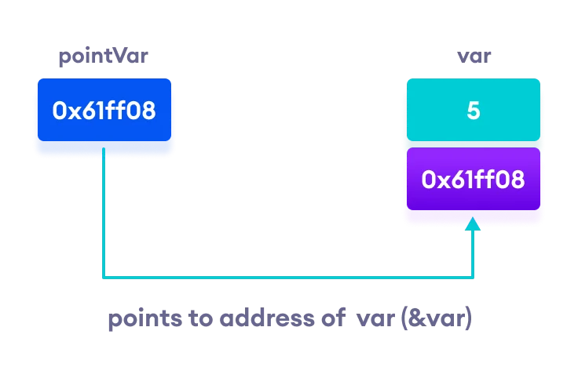

<br />

A pointer is a variable that stores the memory address of an object.
As we all know in C++ every variable is memory location and every memory location has its address defined which can be accessed using `&` operator also know as reference operator, which refers to address in memory.

An example of how to get memory location using `&` operator:
```cpp
#include <iostream>

using namespace std;
int main () {
   int  num;
   char letters[10];

   cout << "Address of num variable: ";
   cout << &num << endl;
   // returns
   // Address of num variable: 0xbfebd5c0

   cout << "Address of letters variable: ";
   cout << &letters << endl;
   // returns bellow
   // Address of letters variable: 0xbfebd5b6

   return 0;
}
```
`0xbfebd5c0` and `0xbfebd5b6` are the memory addresses where these varaibles are stored in.


The addresses above can be stored in pointer. Like any variable or constant you must declare a pointer before you work with it.

`type *var-name`

we declare the type of the what being stored in that address, then we have the asterisk known as Dereference operator (*) which is used to refer the varaible as a pointer and the varaible name of that pointer.

Here are valid pointers:
```cpp
int    *x;    // a pointer to integer
double *x;    // a pointer to double
float  *x;    // a pointer to float
char   *ch     // a pointer to a character
```

### How to use a pointer
1. Define a pointer varaible
2. Assigning the address of a variable to a pointer using reference operator(&) which returns the address of that variable.
3. accessing the value stored in the address using Dereference operator(*) which returns the value of the variable stored at that address

```cpp
#include <iostream>

using namespace std;
int main () {
   int  num = 20;

  // declare pointer variable
   int* ptr;

   // note that data type of ptr and var must be same
    ptr = &num; 

   cout << "Value at ptr: ";
   cout << ptr << endl;
   // returns
   // Value at ptr:  0xbfebd5c0

   cout << "value at num: ";
   cout << num << endl;
   // returns bellow
   // value at num: 20

   cout << "value at *ptr: ";
   cout << *ptr << endl;
   // returns bellow
   // value at *ptr: 20

   return 0;
}
```

> There are three ways to declare pointer variables, but the first way is preferred:

```cpp
string* mystring; // Preferred
string *mystring;
string * mystring;
```

#### Working of C++ Pointers

```cpp
#include <iostream>
using namespace std;
int main() {
    int var = 5;

    // declare pointer variable
    int* pointVar;

    // store address of var
    pointVar = &var;

    // print value of var
    cout << "var = " << var << endl;

    // print address of var
    cout << "Address of var (&var) = " << &var << endl
         << endl;

    // print pointer pointVar
    cout << "pointVar = " << pointVar << endl;

    // print the content of the address pointVar points to
    cout << "Content of the address pointed to by pointVar (*pointVar) = " << *pointVar << endl;
    
    return 0;
}
```

Output:
```
var = 5
Address of var (&var) = 0x61ff08

pointVar = 0x61ff08
Content of the address pointed to by pointVar (*pointVar) = 5
```




#### Changing Value Pointed by Pointers

If `pointVar` points to the address of `var`, we can change the value of `var` by using `*pointVar`.

For example:

```cpp
int var = 5;
int* pointVar;

// assign address of var
pointVar = &var;

// change value at address pointVar
*pointVar = 1;

cout << var << endl; // Output: 1
```

Another Example of changing value by pointers:
```cpp
#include <iostream>
using namespace std;
int main() {
    int var = 5;
    int* pointVar;

    // store address of var
    pointVar = &var;

    // print var
    cout << "var = " << var << endl;

    // print *pointVar
    cout << "*pointVar = " << *pointVar << endl
         << endl;

    cout << "Changing value of var to 7:" << endl;

    // change value of var to 7
    var = 7;

    // print var
    cout << "var = " << var << endl;

    // print *pointVar
    cout << "*pointVar = " << *pointVar << endl
         << endl;

    cout << "Changing value of *pointVar to 16:" << endl;

    // change value of var to 16
    *pointVar = 16;

    // print var
    cout << "var = " << var << endl;

    // print *pointVar
    cout << "*pointVar = " << *pointVar << endl;
    return 0;
}
```

Output:
```
var = 5
*pointVar = 5

Changing value of var to 7:
var = 7
*pointVar = 7

Changing value of *pointVar to 16:
var = 16
*pointVar = 16
```

## Wrapping up

Volla, We know have a basic understanding of pointers.
Pointers have many but easy concepts and they are very important to C++ programming. We can read more about Null pointers, pointer Arithmetic, Pointer to Pointer, passing Pointers to functions, passing references as parameters to understand more about parameters

If you have any questions drop them in the [comment section of this tweet](https://twitter.com/b0nvic/status/1495106911603245061?s=20&t=BmI7UQBSaxUdxIEwmap4Mg).

Thanks for reading, cheers 🥂
