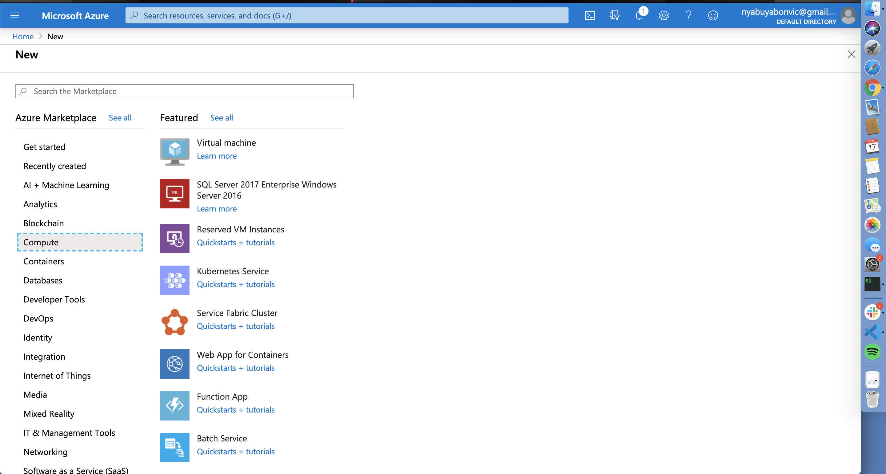
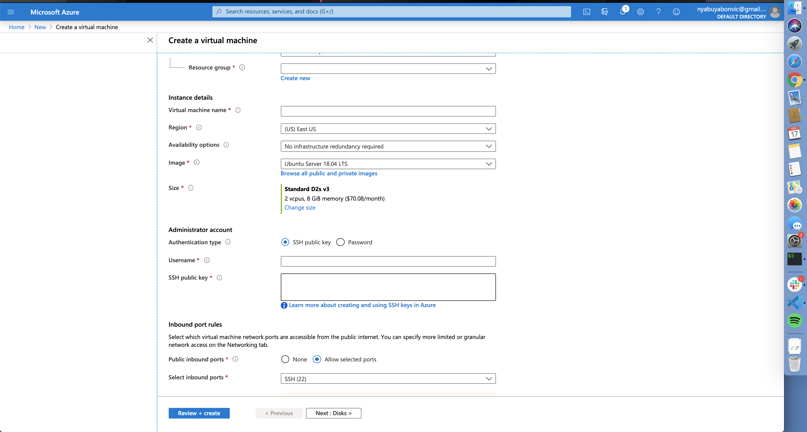
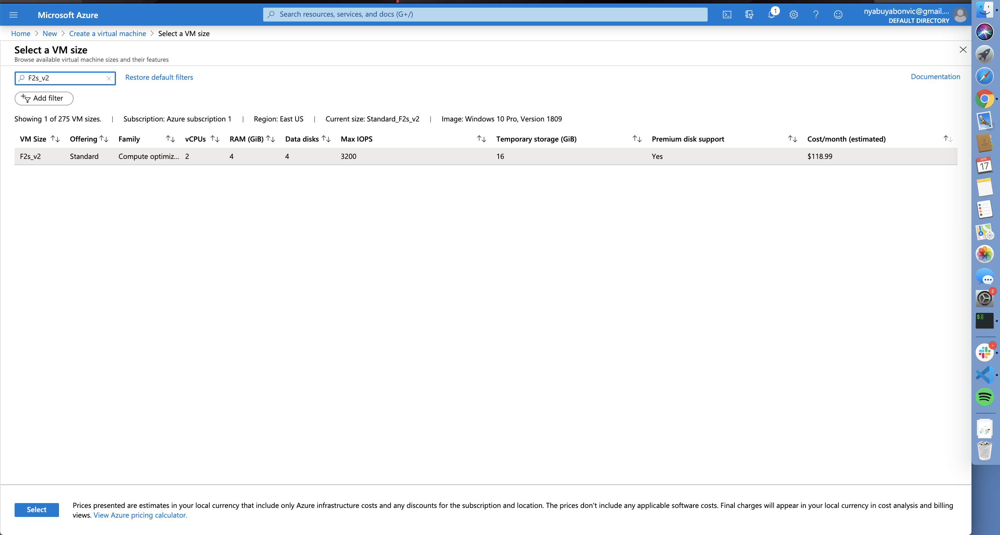
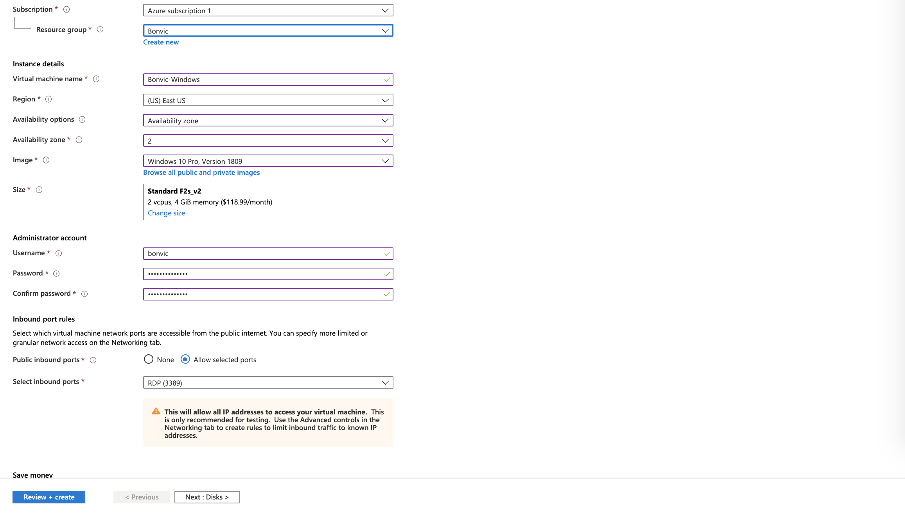
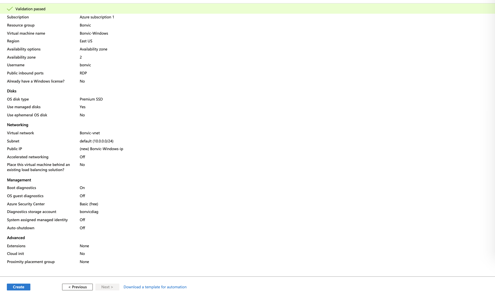
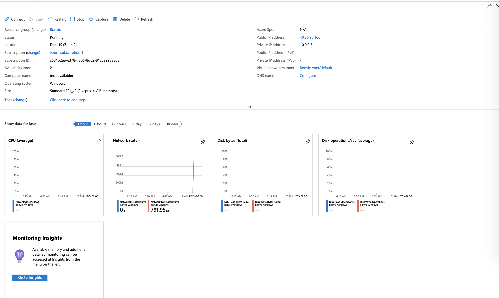
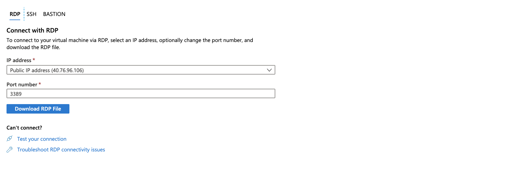
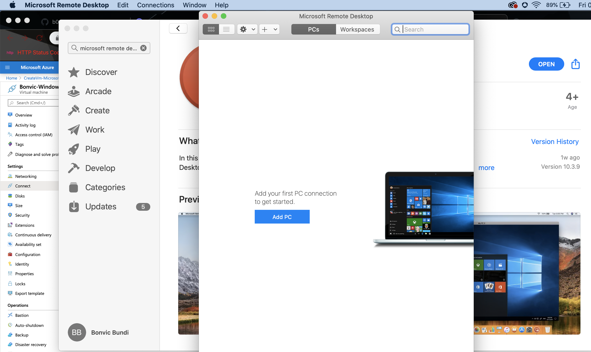
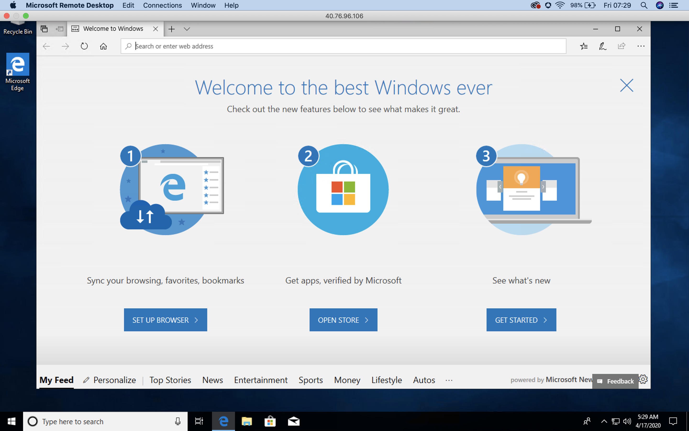

## The problem

I wanted to do my google certifications exams but I had an issue, my latency tests were failing due to slow internet connection. My alternative was to look for a good remote virtual machine to help me work on my certificatons exams.

After evaluating the options that were available online I decided to go with [Microsoft Azure Virtual Machines](https://azure.microsoft.com/en-us/services/virtual-machines/). It has a free plan and provides what I need to get my exams done.
So I'm gonna guide you on how to set up a Windows virtual machine on your PC.

> Microsoft Azure offers great services and it has a free plan for the first 12 months. The free plan can help you learn and gain devops skills using Microsoft Azure. Signup here for a free plan on [Microsoft Azure](https://azure.microsoft.com/en-us/free/) 

## Setting Up the VM on Azure

1. First register into <a href="https://azure.microsoft.com/en-us/free/" target="_blank">Microsoft Azure</a>, if you don't have an account.

 

2. Navigate to [Azure Portal](https://portal.azure.com/#home)

 

  

 

3. Click on [Create a Resource](https://portal.azure.com/#create/hub) and on the left side, navigate to compute

     

    

     

4. Click on [Virtual Machines](https://portal.azure.com/#create/Microsoft.VirtualMachine-ARM) 

 

 

5. Now let's Create a Virtual Machine.
      - Select the subscription as default.
      - create a new resource group on the subscription resource group.
      - Give your VM a name on the virtual machine Name.
      - You can leave the default region setting
      - on availability, option choose Availability zone and give it availability zone of 2
      - The image we are going to use Windows 10 pro.
      - Select Size, on a free plan; the size offered is F2s_v2 so choose select size remove the filter search options and then search for it. Choose it and hit select which is at the bottom left of the page
           

          
           
      - Create an Administrator account for your VM. Enter your preferred Username and password. Make sure to keep them somewhere.
      - on the inbound port rules. Choose allow selected ports and then select RDP which will enable us to connect to our remote desktop
      - by now we should have such configurations:
         

        

         
      - Click Review and Create and wait for the validations to pass
         

        
         
      - Now click create and wait for your VM to be deployed. It will take a few minutes.

## Create a RDP connection

After the virtual machine has been deployed, you can now click on `Go to the Resource` button and it will provide with a nice dashboard of your VM.
 

 

Click Connect and the choose RDP, this will provide a remote desktop access port.
 

 

## Install Microsoft Remote desktop on your Mac

1. Go to the app store and search for Microsoft Remote desktop and then install

2. Open the application after installation

       

      
       
3. Click `Add PC` and then let's fill the fields:
    - add IP address of your VM. We can get it from our created RDP connection on Azure, IP address value.
    - On the User, account select add a new user account and then use the details that used when creating VM administrator account.
       
      
      
       
    - Click add, it will create the PC

4. Next double click on the created PC. It will start connecting to your VM
5. If the certificate warning comes up you can click continue
6. Viola! you have just created a Windows 10 VM on Azure and Run it on your pc
 

 

Now you can enjoy using a fast VM on your machine.

> When the VM is not in Use don't forget to stop it, so as to save your credits.

Hope you found this Article useful, Cheers 🥂!!
